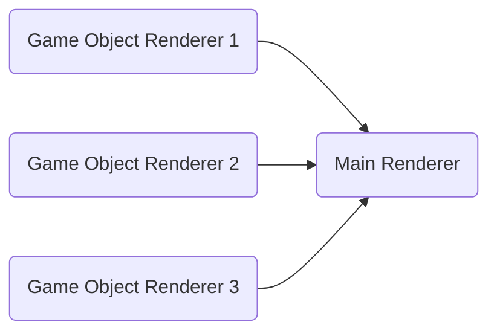

# About
This module provides live coding in pygame.You can see your code changes at once without restart application.


https://user-images.githubusercontent.com/125838640/226334376-04f91f11-1775-49e5-8b04-2704e3355197.mp4


&nbsp;
&nbsp;
&nbsp;


> **Note:** Your Game should be implemented OOP style

# Installing

>**pip install pygamelive**


# How to use?

## Step 1

Import PygameLive class from package.
```python
from pygamelive import debugger
```

## Step 2

Create instance of PygameLive class in your game class.
```python
def __init__(self):
        pg.init()
        self.screen = pg.display.set_mode(RES)
        self.clock = pg.time.Clock()
        self.load_assets()
        self.sound = Sound()
        self.score = Score(self)
        self.fire = DoomFire(self)
        self.new_game()

        self.py_live = debugger.PygameLive()
  ```

## Step 3

Use **debug** method on your draw, update and check_event methods in your game loop.


```python
def run(self):
        while True:
            # self.check_events()
            # self.draw()
            # self.update()
            #Live coding
            self.py_live.debug(self.draw)
            self.py_live.debug(self.update)
            self.py_live.debug(self.check_events)
```


**Your code changes on the methods which you added using **self.py_live.debug(self.draw)** will be displayed immediately**
> **Note:** You can name your methods differently but the design of your game should be alike the design pattern noted below.


# Example Game

Example game (FlappyDooM) is made by Stanislav Petrov [StanislavPetrovV](https://github.com/StanislavPetrovV). 

# Critical Info
You should design your game like this to work PygameLive properly(highly recommended to look up example folder):


> **Note:** Please look up example repo and change main.py file with the orginal one.
